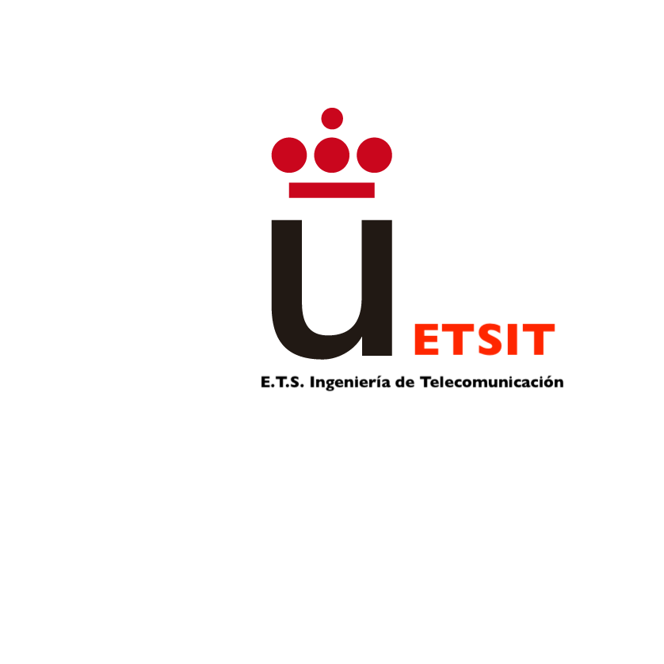

 
Estás invitado a venir a visitarnos con familiares y amigos al campus
de
Fuenlabrada. [Apúntate](https://docs.google.com/forms/d/e/1FAIpQLSfnzPPIRAhHdoPxEn4VdFX1zP4V9BfO_-W3WGLmf9v__glBLw/viewform)
para conocer in situ los laboratorios de nuestra escuela en el campus
de Fuenlabrada de la URJC: los profesores te explicarán qué se hace en
cada laboratorio, podrás asistir como oyente a clases reales y
participar en actividades preparadas para los futuros alumnos de
nuestra escuela. **¡No te lo pierdas!**

¿Quieres saber qué ingenierías se pueden estudiar en el campus de Fuenlabrada? 
<iframe width="853" height="480" src="https://www.youtube.com/embed/p0QeWRhTjL4" frameborder="0" allow="accelerometer; autoplay; encrypted-media; gyroscope; picture-in-picture" allowfullscreen></iframe>

Escucha lo que tienen que contar nuestros exalumnos de ingeniería en tecnologías de telecomunicación, en telemática, en sistemas de telecomunicación y en sistemas audiovisuales y multimedia, *los ingenieros de lo invisible*:
<iframe width="853" height="480" src="https://www.youtube.com/embed/XQAm0f2qFHE" frameborder="0" allow="accelerometer; autoplay; encrypted-media; gyroscope; picture-in-picture" allowfullscreen></iframe>

Lee este artículo para saber más sobre las salidas profesionales de la
ingeniería de telecomunicación: [El ingeniero de telecomunicación, un
perfil profesional que
escasea](https://cincodias.elpais.com/cincodias/2017/12/07/fortunas/1512672717_671641.html).

El edificio Hangar/Laboratorio VI sigue llenándose de instrumental, naves aeroespaciales y simuladores de vuelo. Ya está casi a punto de poder ser utilizado por nuestros alumnos de grado. Entra a verlo en este vídeo:
<iframe width="853" height="480" src="https://www.youtube.com/embed/lZEAVjVpQ1U" frameborder="0" allow="accelerometer; autoplay; encrypted-media; gyroscope; picture-in-picture" allowfullscreen></iframe>

# ¿Qué grados y másteres puedo estudiar en la ETSIT URJC?

  * [Ingeniería de Robótica Software](http://www.urjc.es/estudios/grado/3099-ingenieria-de-robotica-software#itinerario-formativo) 
  * [Ingeniería Biomédica](http://www.urjc.es/universidad/facultades/escuela-tecnica-superior-de-ingenieria-de-las-telecomunicaciones/2001-ingenieria-biomedica)
  * [Ingeniería en Tecnologías de la Telecomunicación](http://www.urjc.es/universidad/facultades/escuela-tecnica-superior-de-ingenieria-de-las-telecomunicaciones/635-ingenieria-en-tecnologias-de-la-telecomunicacion). Ver [vídeo de alumnos](https://vimeo.com/12791620)
  * [Biomedical Engineering (Campus de Alcorcón)](http://www.urjc.es/universidad/facultades/escuela-tecnica-superior-de-ingenieria-de-las-telecomunicaciones/2462-biomedial-engineering)
  * [Ingeniería Aeroespacial en Aeronavegación](http://www.urjc.es/universidad/facultades/escuela-tecnica-superior-de-ingenieria-de-las-telecomunicaciones/648-ingenieria-aeroespacial-en-aeronavegacion). Ver [vídeo de los laboratorios / hangar](https://tv.urjc.es/video/5a3d14dad68b14515f8b4572)
  * [Ingeniería Aeroespacial en Vehículos Aeroespaciales](http://www.urjc.es/universidad/facultades/escuela-tecnica-superior-de-ingenieria-de-las-telecomunicaciones/2460-ingenieria-aeroespacial-en-vehiculos-aeroespaciales)
  * Ingeniería Aeroespacial en Transporte y Aeropuertos (En trámite)
  * [Ingeniería en Telemática](http://www.urjc.es/universidad/facultades/escuela-tecnica-superior-de-ingenieria-de-las-telecomunicaciones/634-ingenieria-telematica). Ver [vídeo de alumnos](https://vimeo.com/12791178)
  * [Ingeniería en Sistemas de Telecomunicación](http://www.urjc.es/universidad/facultades/escuela-tecnica-superior-de-ingenieria-de-las-telecomunicaciones/636-ingenieria-en-sistemas-de-la-telecomunicacion). Ver [vídeo de alumnos](https://vimeo.com/12789875)
  * [Ingeniería en Sistemas Audiovisuales y Multimedia](http://www.urjc.es/universidad/facultades/escuela-tecnica-superior-de-ingenieria-de-las-telecomunicaciones/637-ingenieria-en-sistemas-audiovisuales-y-multimedia). Ver [vídeo de alumnos](https://vimeo.com/12850279)
  * **Dobles grados**:
    * [Ingeniería en Sistemas de Telecomunicación + Administración y Dirección de Empresas](http://www.urjc.es/universidad/facultades/escuela-tecnica-superior-de-ingenieria-de-las-telecomunicaciones/1005-ingenieria-en-sistemas-de-telecomunicacion-administracion-y-direccion-de-empresas)
    * [Ingeniería en Tecnologías de la Telecomunicación + Ingeniería Aeroespacial en Aeronavegación](http://www.urjc.es/universidad/facultades/escuela-tecnica-superior-de-ingenieria-de-las-telecomunicaciones/693-ingenieria-en-tecnologias-de-la-telecomunicacion-ingenieria-aeroespacial-en-aeronavegacion)
  * [Máster Universitario en Ingeniería de Telecomunicación](https://www.urjc.es/estudios/master/872-ingenieria-de-telecomunicacion)

# Conoce los 25 laboratorios de la ETSIT en el campus de Fuenlabrada

El carácter experimental y altamente especializado de los estudios de
una escuela de ingeniería de telecomunicación, de aeronáutica,
biomédica y robótica software de calidad conlleva que cada semana los
1200 alumnos de la escuela tengan que realizar sus clases de grado en
laboratorios docentes equipados con material didáctico de laboratorio
diverso, con hardware y software muy especializado.

En la ETSIT nos preocupa especialmente este aspecto de la
docencia. Cada vez son más las asignaturas que se imparten
íntegramente en laboratorios. Muchas otras tienen docencia en
laboratorios todas las semanas.

Estos son los 25 laboratorios docentes que la ETSIT URJC mantiene en
el Campus de Fuenlabrada. Si no los conoces, apúntate para venir a que
te los enseñemos in situ en el campus de Fuenlabrada de la URJC:

1. Laboratorio de Equipos y Tratamiento de Información Multimedia
(software y hardware). L2007. Este laboratorio consta de 15 puestos de
trabajo dotados del hardware y el software necesario para llevar a
cabo procesamiento digital de audio. También consta de 15 puestos para
el análisis y planificación de equipos y sistemas audiovisuales.

2. Laboratorio de Física (hardware). El Laboratorio L2008 consta de 40 puestos de trabajo con el equipamiento necesario para realizar diversos tipos de prácticas de física (mecánica, dinámica, electromagnetismo, etc.).

3. Laboratorio de Procesamiento Digital (software y hardware). El Laboratorio L2009 consta de 40 puestos de trabajo equipados con placas DSP (procesadores digitales de señal, conversores A/D, muestreadores, dispositivos de control, transceptores audio,…) para realizar procesado digital de señal en tiempo real.

4. Laboratorio de Electrónica (hardware). El Laboratorio L2010 consta de 25 puestos de trabajo equipados con placas Coldfire para realizar prácticas básicas de diseño y programación a bajo nivel de microcomputadores (microprocesadores, FPGAs, circuitos de acondicionamiento, osciloscopios, placas de inserción).

5. Laboratorio de Televisión Digital (software y hardware). El Laboratorio L2102 consta de 32 puestos de trabajo dotados del hardware y el software necesario para el análisis y tratamiento de señal de televisión digital. Incluye programas de análisis de audio y vídeo de alta definición, equipos, así como moduladores multiportadora y tarjetas de recepción de señal.

6. Laboratorio de Análisis y Diseño de Circuitos (hardware). El Laboratorio L2103 consta de 30 puestos de trabajo dotados de todo el equipamiento necesario (fuentes de alimentación, generadores de señal, osciloscopios, polímetros y software de control) para diseñar, construir y verificar el funcionamiento de circuitos eléctricos y electrónicos.

7. Laboratorio de Desarrollo Web (software): El Laboratorio L2108 es un Laboratorio con 18 máquinas (más un puesto de profesor) configuradas como estaciones de trabajo de tipo Unix (GNU/Linux y BSD). Todos ellos cuentan de monitores de alta resolución de 23 pulgadas, equipos HP EliteDesk con discos duros SSD de 256 GB, 8 GB de memoria y procesadores Intel i5 de sexta generación. Los equipos están conectados mediante una red Ethernet 100 Mbit/s, y en ellos está instalado software que incluye entornos de virtualización y entornos de desarrollo de software en todos los lenguajes utilizados en prácticas relacionadas con el desarrollo de aplicaciones web.

8. Aulas Informáticas Windows (software). Ubicadas en los Laboratorios
L2005 y L2006. Laboratorios de informática con un total de 80
ordenadores personales con el sistema operativo Windows, con software
especializado de simulación y programación. Estos laboratorios están
administrados por el Servicio de Informática de la URJC y tienen una
configuración dual para su uso en la ETSIT, como estaciones de trabajo
y como puestos virtualizados en el esquema de virtualización estándar
de la URJC. Estos equipos cuentan con monitores de alta resolución,
discos duros de alta velocidad, 4/8 GB de memoria y procesadores i5 o
similar. 

9. Sala Reverberante. Sótano edificio Laboratorios II.

10. Sala Anecoica y Sala de Fabricación de Dispositivos. Sótano edificio Laboratorios II.

11. Aulas Informáticas Windows (software). Los Laboratorios L3007 y L3102 suman un total de 80 ordenadores personales con el sistema operativo Windows, con software especializado de simulación y programación. Estos laboratorios están administrados por el Servicio de Informática de la URJC y tienen una configuración dual para su uso en la ETSIT, como estaciones de trabajo y como puestos virtualizados en el esquema de virtualización estándar de la URJC. Estos equipos cuentan con monitores de alta resolución, discos duros de alta velocidad, 4/8 GB de memoria y procesadores i5 o similar. Los equipos están también conectados mediante una red Ethernet 100 Mbit/s.

12. Laboratorio de Ingeniería Aeroespacial (software y hardware). El Laboratorio L3103 es un Laboratorio dotado de servidores remotos de alto rendimiento para la ejecución de programas de optimización y control. Incluye también 20 puestos de simulación de vuelo asistidos por ordenador. 

13. Laboratorio de Robótica y Sistemas Ubicuos (hardware). El Laboratorio L3104, es un laboratorio dotado con distintos tipos de robots (robots móviles con ruedas Kobuki, humanoides Nao, y drones) y otro hardware dedicado a la robótica (láseres Hokuyo y cámaras de color y ocho sensores RGBD Xtions). Para las asignaturas de Sistemas Móviles y Ubicuos, el laboratorio dispone de dispositivos móviles Android, distintos tipos de placas Arduino y diferentes tipos de actuadores y sensores.

14. Laboratorio de Ingeniería Acústica (software y hardware). El Laboratorio L3108, en su su parte software consta de 20 puestos para realizar simulación de acústica ambiental y acústica arquitectónica. En su parte hardware, consta de 20 puestos con analizadores sonoros, fuentes, máquinas de impacto y cámara anecoica para realización de medidas y experimentos acústicos.

15. Laboratorio de Software Defined Radio (hardware): El Laboratorio L3109 es un laboratorio equipado con puestos de radio definida por software, formados por PCs dotados de GNURadio y USRPs (Universal Software Radio Peripheral) de distintos tipos. Este laboratorio está orientado a la realización de prácticas que permiten desde entender conceptos básicos como el espectro electromagnético, las modulaciones, etc. hasta sistemas de comunicaciones digitales de banda ancha multiportadora. Además, el Laboratorio cuenta con 40 dispositivos USB DVB-TV sintonizadores para la realización de las prácticas de SDR.

16. Laboratorio de Robótica Software (software), El Laboratorio L3202, cuenta con 44 estaciones de trabajo GNU/Linux con Pcs HP Elite Desk de última generación, con procesadores i5 de sexta generación, discos SSD de 256 GB, 8 GB de RAM, pantallas HP de 23 pulgadas. Este Laboratorio se encuadra dentro del conjunto de Laboratorios de Linux de la ETSIT. 

17. Laboratorio de Ingeniería Biomédica I (software): El Laboratorio de Ingeniería Biomédica I, cuenta con 56 estaciones de trabajo GNU/Linux (más puesto de profesor), con  PCs HP Elite Desk de última generación, con procesadores i5 de sexta generación, discos SSD de 256 GB, 8 GB de RAM, pantallas HP de 23 pulgadas. En estos puestos se utilizan programas relacionados con adquisición y tratamiento de imágenes médicas por software. Además, los alumnos pueden usar la Infraestructura de virtualización MyAPPs de la URJC. 

18. Laboratorio de Ingeniería Biomédica II (software y hardware): El Laboratorio L3204, cuenta con 46 estaciones de trabajo GNU/Linux con  PCs HP Elite Desk de última generación, con procesadores i5 de sexta generación, discos SSD de 256 GB, 8 GB de RAM, pantallas HP/Samsung de 23 pulgadas. En estos puestos se utilizan programas relacionados con adquisición y tratamiento de imágenes, datos y señales médicas por software. Además, los alumnos pueden usar la Infraestructura de virtualización MyAPPs de la URJC. El Laboratorio cuenta además con ecógrafos, estetoscopios, microscopios, varios cascos de EEG de 32 canales y kits Bluetooth Bitalino para la captura de señales fisiológicas. El Laboratorio posee unidades de adquisición de datos Biopack para registrar mediciones fisiológicas (EMG, ECG, EEG) en tiempo real y realizar su posterior análisis. 

19. Laboratorio de Campos Electromagnéticos y Radiación (Antenas), Microoondas y Alta Frecuencia (hardware). El Laboratorio L3205  consta de 20 puestos de trabajo para realizar prácticas de medida de señales de radiofrecuencia y construcción de circuitos de microondas equipados (generadores de señal, analizadores de redes y bancos de microondas, antenas isotrópicas y directivas, arrays de antenas, estructuras para el posicionamiento de sistemas radiantes, analizadores de espectros y analizadores de espectro móviles).

20. Laboratorio de Sistemas Operativos y Middleware (software). El Laboratorio L3207, cuenta con 50 estaciones de trabajo (más un puesto de profesor) configuradas como estaciones de tipo Unix (GNU/Linux y BSD). Todos ellos cuentan son Dell OptiPlex i5 con 8/16GB de RAM y 250/500GB. Este Laboratorio cuenta con acceso Gigabit ethernet (1Gb/s) a la red de datos de la URJC, y en ellos está instalado software que incluye entornos completos de desarrollo de software en todos los lenguajes utilizados en prácticas relacionadas con el Software de Sistemas. Este laboratorio comparte infraestructura con el resto de laboratorios GNU/Linux y BSD de la ETSIT (L2108, L3202, L3203, L3204, L3208, L3209, L3210), proporcionando un entorno homogéneo al usuario, accesible en remoto a través un conjunto de máquinas virtuales disponibles 24/7 y acceso remoto VNC mediante un navegador.

21. Laboratorio de Arquitecturas de Red (software). El Laboratorio L3208 consta de 50 PCs (más un puesto de profesor) configuradas como estaciones de trabajo de tipo Unix (GNU/Linux y BSD). Todos ellos son equipos Dell OptiPlex 790 , procesador i5 con 16GB de RAM y 500GB de disco duro, con tarjeta gráfica NVidia GeForce 645 y doble tarjeta de red. Este Laboratorio cuenta con acceso Gigabit ethernet (1Gb/s) a la red de datos de la URJC, y en ellos está instalado software que incluye entornos completos de desarrollo de software en todos los lenguajes utilizados en prácticas relacionadas con las arquitecturas de red y asignaturas de telemática.

22. Laboratorio de Sistemas Distribuidos y Cloud Computing (software). El Laboratorio L3209 es un laboratorio dotado con 56 PCs (más un puesto de profesor) configuradas como estaciones de trabajo de tipo Unix (GNU/Linux y BSD). Todos ellos son equipos Dell OptiPlex 790, con procesadores i5, 16GB de RAM y 500GB de disco duro, con tarjeta gráfica NVidia GeForce 645 y doble tarjeta de red. Este Laboratorio cuenta con acceso Gigabit ethernet (1Gb/s) a la red de datos de la URJC, y en ellos está instalado software que incluye entornos de virtualización y entornos de desarrollo de software en todos los lenguajes utilizados en prácticas relacionadas con el desarrollo de aplicaciones, sistemas distribuidos, concurrencia y Cloud Computing.

23. Laboratorio de Virtualización de Redes (software). El Laboratorio L3210 es un Laboratorio dotado con 70 PCs (más un puesto de profesor) configuradas como estaciones de trabajo de tipo Unix (GNU/Linux y BSD). Todos ellos son Dell OptiPlex i7 con 16GB de RAM y 250GB de disco duro. Este Laboratorio cuenta con acceso Gigabit ethernet (1Gb/s) a la red de datos de la URJC, y en ellos está instalado software que incluye entornos de virtualización y entornos de desarrollo de software en todos los lenguajes utilizados en prácticas relacionadas con virtualización y desarrollo de sistemas telemáticos.

24. Laboratorio de Ingeniería Biomédica (Campus de Alcorcón): La ETSIT posee un Laboratorio GNU/Linux dedicado a los alumnos de Ingeniería Biomédica (inglés) en el Campus de Alcorcón, análogo a los Laboratorios que posee en el Campus de Fuenlabrada. El Laboratorio 1.106 (Aulario I) cuenta con un total de 50 Pcs (más puesto de profesor) con estaciones de trabajo GNU/Linux Dell OptiPlex 7050, con discos SSD de 256 GB de alto rendimiento, procesadores i5 de séptima generación, 8 GB de RAM, pantallas Dell panorámicas de 21 pulgadas, y acceso a la red de datos de la URJC mediante enlace de 100 Mbit/s. Para los alumnos de Alcorcón se facilita un acceso remoto VNC-WEB para que puedan usar sus cuentas de Linux desde un navegador WEB, al igual que para los alumnos de Fuenlabrada.

25. Hangar/Laboratorio VI

**Otros recursos no materiales**
Acceso remoto completo a las estaciones de trabajo Linux a 1Gbps, Servidor de repositorios Git GitLab y servidor de base de datos MySQL, a disposición de los alumnos de la ETSIT.

Para garantizar el correcto funcionamiento y mantenimiento de estas
instalaciones, la ETSIT cuenta con un equipo humano de cinco técnicos
de Laboratorio dedicados a tiempo completo al mantenimiento de estas
instalaciones en el Campus de Fuenlabrada y de Alcorcón.

# Actualidad ETSIT URJC
<a class="twitter-timeline" data-width="400" data-theme="dark" href="https://twitter.com/ETSIT_URJC?ref_src=twsrc%5Etfw">Tweets by ETSIT_URJC</a>  

[Pregúntanos lo que necesites saber sobre los estudios de la ETSIT URJC y te contestaremos](https://docs.google.com/forms/d/e/1FAIpQLSfq8PPwKMqxfPQz08-ZcpVyQrPoycx_PFC5D_5j7A9lUUfr4w/viewform)

Estás invitado a venir a
visitarnos al campus de Fuenlabrada. [Apúntate](https://docs.google.com/forms/d/e/1FAIpQLSfnzPPIRAhHdoPxEn4VdFX1zP4V9BfO_-W3WGLmf9v__glBLw/viewform)
para conocer in situ los laboratorios de nuestra escuela en el campus
de Fuenlabrada de la URJC: los profesores te explicarán qué se hace en
cada laboratorio, podrás asistir como oyente a clases reales y participar en actividades preparadas para los futuros alumnos de nuestra escuela. **¡No te lo pierdas!**

