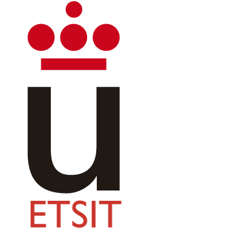

open.ETSIT es un espacio de encuentro entre los futuros
alumnos, los actuales, y los exalumnos de nuestra escuela.

### ¿Qué puedo estudiar en la ETSIT-URJC?

* Ingeniería en Robótica Software
* Biomedical Engineering (Campus de Alcorcón)
* Ingeniería Aeroespacial en Aeronavegación
* Ingeniería Aeroespacial en Vehículos Aeroespaciales
* Ingeniería Biomédica
* Ingeniería en Sistemas Audiovisuales y Multimedia
* Ingeniería en Sistemas de Telecomunicación
* Ingeniería en Tecnologías de la Telecomunicación
* Ingeniería en Telemática
* **Dobles grados**:
  * Ingeniería en Sistemas de Telecomunicación + Administración y Dirección de Empresas
  * Ingeniería en Tecnologías de la Telecomunicación + Ingeniería Aeroespacial en Aeronavegación

## Actualidad ETSIT-URJC
<a class="twitter-timeline" data-width="400" data-theme="dark" href="https://twitter.com/ETSIT_URJC?ref_src=twsrc%5Etfw">Tweets by ETSIT_URJC</a>  
